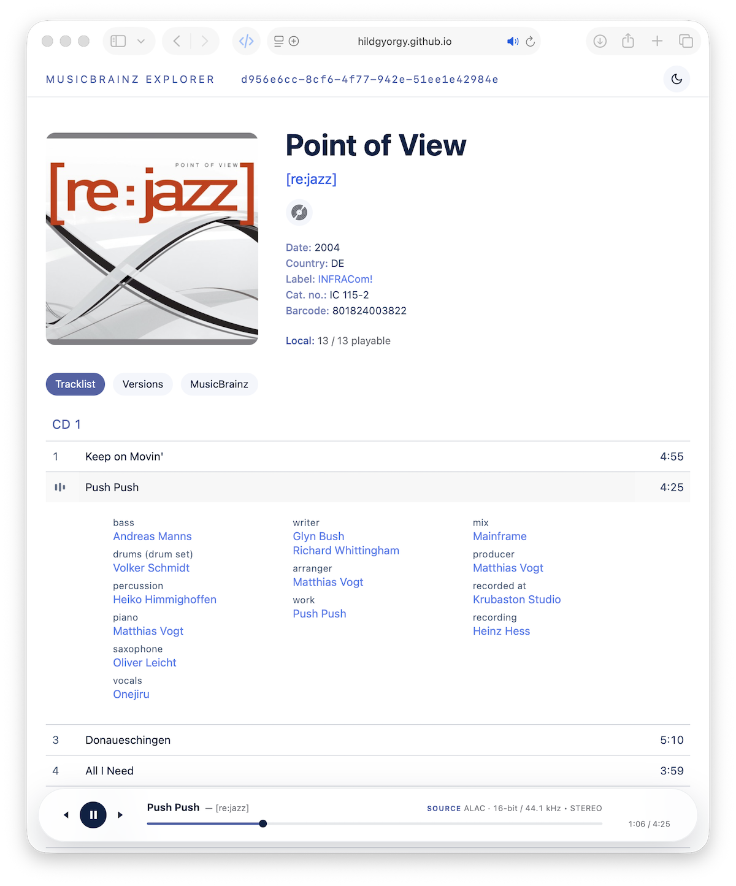

# MusicBrainz Explorer

_version 1.5.0_

A small, framework-free web app for exploring MusicBrainz releases and playing
the matching files from your own music library.

▶ [Open MusicBrainz Explorer](https://hildgyorgy.github.io/mb-explorer/)

❔ [How to, support and privacy](https://hildgyorgy.github.io/mb-explorer/support.html)

Built on the MusicBrainz API and Cover Art Archive. Designed for clear credits,
calm navigation and an optional local playback layer.

**Explore releases. Play your own library.**

## What it focuses on

- Fast MusicBrainz release search
- Clean release overview with cover art and edition metadata
- Expandable track details with performers, writers, works and technical credits
- Versions of the same release group
- Artist information and discography
- Cover navigation and links to MusicBrainz and supported streaming services
- Classical works and movements presented as structured track groups
- Light and dark themes with responsive desktop and mobile layouts
- Local-library results integrated into the same MusicBrainz search
- Local-folder and Navidrome/OpenSubsonic library sources
- System-audio playback; UPnP network-renderer output is under development
- MusicBrainz compatibility reports for connected libraries
- Minimal playback controls that stay available while browsing other releases
- Source information such as codec, bit depth, sample rate and channel count

The Explorer remains a complete MusicBrainz viewer without a connected music
folder. Local playback is an optional additional layer.

## Searching MusicBrainz

Use the search field at the top of the page:

| Input | Search |
| --- | --- |
| `miles davis,` | Artist |
| `, kind of blue` | Release or track title |
| `miles davis, so what` | Combined artist and release/track search |
| `353021d1-3d84-4f17-9fe4-66788d785a9d` | Exact release MBID |

You can also paste a MusicBrainz release URL.

## Playing your local music

The Explorer does not identify albums from folder names. It connects local
files to MusicBrainz releases and recordings using the MBIDs embedded in their
metadata.

### Requirements

- Music files tagged with [MusicBrainz Picard](https://picard.musicbrainz.org/)
- A MusicBrainz release MBID in each file
- A MusicBrainz recording MBID in each file
- FLAC or M4A files (ALAC/AAC)
- A generated `library.json` file in the root of the selected Music folder

The current library model assumes that one folder represents one MusicBrainz
release. Multi-disc releases work naturally when all their files are kept in
that release folder; MusicBrainz provides the disc and track structure shown
by the Explorer.

### 1. Create the library index

There are two supported methods.

#### Browser indexer

1. Open the Explorer.
2. Select the pulsing logo, open **Source**, then choose **Local**.
3. Select **Create Library Index** and choose the root of your Music folder.
4. Approve saving the generated index and report.
5. Keep `library.json` and `library-report.json` in the root of the selected Music folder.

Indexing happens entirely in the browser. Embedded cover artwork is skipped;
only the required tags, technical audio properties and relative file locations
are read. The generated file uses index format version 2 and stores both the
MusicBrainz recording and release-track IDs. When an existing version 2
`library.json` is present, unchanged album folders are reused and only changed
folders are read again.

At the end of indexing, the Explorer shows a local tagging report grouped into
fully tagged, partially tagged, missing-release-MBID and incomplete-metadata
albums. Display names come from embedded Album Artist and Album tags; folder
names are never used as album identities in the report. The report is also
saved as `library-report.json`, so it can be reopened after reconnecting the
Music folder.

The new index is active immediately. Browsers with persistent directory-handle
support remember the selected folder and restore it automatically. A browser
may still ask you to approve access again; browsers without this support
require the folder to be selected again.

Some browsers use the word **Upload** in their native folder picker. Despite
that wording, the Explorer does not upload your index or music files to a
server.

#### Python indexer

[`generate_library.py`](generate_library.py) provides a faster command-line
alternative for large libraries. It uses only the Python standard library and
requires no additional packages.

macOS or Linux:

```bash
python3 generate_library.py "/path/to/Music"
```

Windows:

```powershell
py generate_library.py "D:\Music"
```

You may also run the script without a path and enter or drag the Music folder
path when prompted:

```bash
python3 generate_library.py
```

By default, the script writes `library.json` and `library-report.json` into the
selected Music folder and reports how many albums and files were indexed and
how long it took.

### 2. Connect or reconnect the Music folder

1. Select the pulsing logo, open **Source**, then choose **Local**.
2. Select **Connect Music Folder**.
3. Choose the same Music folder that contains `library.json`.
4. Confirm the browser's folder-selection dialog.

The Explorer loads the index and receives browser-controlled access to the
selected files. When persistent directory handles are supported, the folder is
remembered across sessions, although the browser may ask for permission again.

### 3. Search and play

Search normally in the same field used for MusicBrainz:

- A small play triangle marks releases found in the connected library.
- Open a marked release.
- Hover over a track number and select the play icon.
- The floating mini-player remains active while you explore another release.

Playability is matched per track. An exact MusicBrainz release-track ID is
preferred; recording ID is used only when release-track data is unavailable.
This prevents another medium or layer of the same release from appearing
playable merely because it uses the same recording.

The release header shows how many tracks are available locally, for example
`Local: 8 / 8 playable`.

## Privacy and local access

- There is no application backend.
- Music files are not uploaded to the project or to MusicBrainz.
- Browser indexing runs locally on your device.
- Playback uses the original file selected from your Music folder.
- Folder access lasts only for the current page session.

The app itself is hosted as static files on GitHub Pages. MusicBrainz metadata
and cover art are requested from their respective public services.

## Audio playback

Playback uses the browser's native HTML audio pipeline. The Explorer requests
the original local file and does not deliberately transcode it.

The mini-player can display source properties stored in the index, for example:

```text
SOURCE ALAC · 16-bit / 44.1 kHz • STEREO
```

Because the browser, operating-system mixer and selected audio device remain
part of the playback chain, bit-perfect output cannot be guaranteed.

## Current scope and limitations

- The indexers currently support FLAC and M4A (ALAC/AAC).
- Files must already be tagged correctly with Picard.
- One local copy is expected for each MusicBrainz release MBID.
- Persistent local-folder access depends on browser support and permission policy.
- Browser support and folder-picker wording vary by platform.
- Cloud-storage connections are not currently supported.

## Architecture

Plain HTML, CSS and vanilla JavaScript ES modules.

- No framework
- No build step
- No application server
- No external runtime dependency for the web app

The source is organized by responsibility:

```text
assets/js/
├── core/       shared state, policies and metadata helpers
├── features/   release page, credits, versions and playback
├── services/   MusicBrainz API, local library and indexers
└── ui/         rendering, search, layout, themes and interactions
```

`generate_library.py` is the optional standalone local indexer.

## Project background

MusicBrainz Explorer evolved from
MusicBrainz Release Viewer
and its local-playback spin-off,
MusicBrainz Release Player.
It preserves the Viewer's release-focused interface and metadata presentation,
then adds local-library mapping and playback.

This is an independent project and is not affiliated with or endorsed by
MusicBrainz or MetaBrainz.

---

© 2026 György Hild<br>
Data: MusicBrainz contributors — CC BY-NC-SA 3.0<br>
Made with respect for structured music data and personal music libraries.
